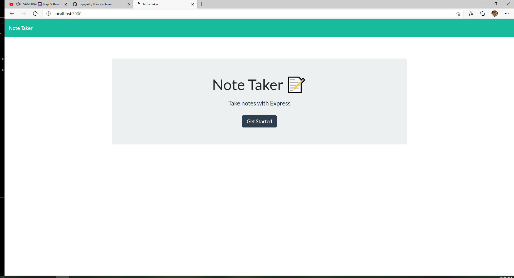

# Mynote-Taker 

## Descrition
This App allows the user to input various tasks that needs to be accomplish. Allowing the User to Add, View and Delete task that they have entered. 

## Table of Contents
   
## Installation
Node
Express

## Heroku
My Heroku Link 
<a href="https://www.w3schools.com/">Visit My Heroku deployed Website</a>

## ScreenShot

